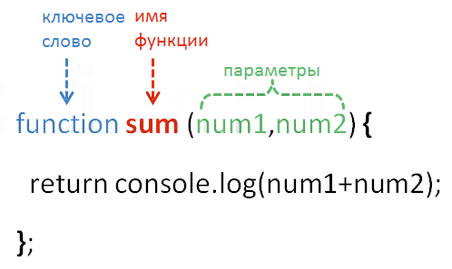

# Lesson_12-Functions

> ### Что такое функции? — _наши действия в JS_

_**Название функции = глагол + приписка объекта, с которым работают** (в режиме [**CamelCase**](https://ru.wikipedia.org/wiki/CamelCase))_

**Для того, чтобы вызвать функцию надо прописать её имя + ()** 
> _в скобках можно передавать значения параметрам функции, если таковые имеются_

_**Если объявить переменную внутри function'ии, то она будет видна только в этой функции**_

> _Локальная переменная — объявлена внутри something и не видна наружу_

_**Для того чтобы переменная воздействовала с функцией и в тоже время была глобальной, надо объявить её вне функции**_

### Замыкание — это функция, со всеми внешними переменными, которые ей доступны

**Используя _return_ в функции можно передавать переменные в глобальное использывание**

**Если вы используете _Function Expression_, то у вас не получится вызвать функцию раньше её объявления.**

_**Словарь**_

[_Function Declaration_](https://learn.javascript.ru/function-expressions-arrows) — «Декларация функции» создается до выполнения любого кода.

[_Function Expression_](https://learn.javascript.ru/function-expressions-arrows) — «Функциональное выражение» будет создано только в момент, когда интерпретатор дойдёт до данной строки кода.
